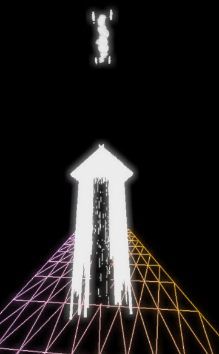

## About The Project



## Tech Stack

- [Next.js](https://nextjs.org/) – `framework`
- [ThreeJS](https://threejs.com/) – `WebGL`
- [Vercel](https://vercel.com/) – `hosting`

## Running the code locally

```bash
# STEP 1: Get sources from GitHub
$ git clone https://github.com/PabloOch/next-shadow-sample.git
$ cd cloud-house

# STEP 2: Install the requirements
$ npm install

# STEP 3: Running the app in dev mode
$ npm run dev
```
